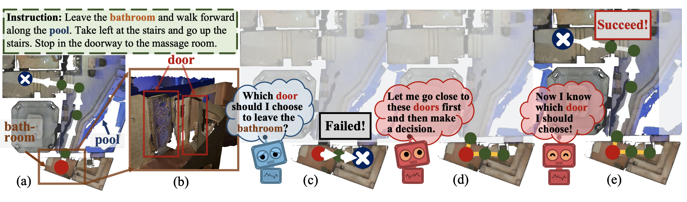

## Active VLN

    

This repository is the implementation of our ECCV 2020 paper:

[Active Visual Information Gathering for Vision-Language Navigation](https://arxiv.org/abs/2007.08037)

[Hanqing Wang](https://https://hanqingwangai.github.io/), [Wenguan Wang](https://sites.google.com/view/wenguanwang), [Tianmin Shu](https://www.tshu.io/index.html), [Wei Liang](http://iitlab.bit.edu.cn/mcislab/~liangwei/), [Jianbing Shen](https://www.researchgate.net/profile/Jianbing_Shen).

-----------

### Introduction
This work draws inspiration from human navigation behavior and endows an agent with an active information gathering ability for a more intelligent vision-language navigation policy. 

To achieve this, we develop an active exploration module, which learns to 1) decide when the exploration is necessary, 2) identify which part of the surroundings is worth exploring, and 3) gather useful knowledge from the environment to support more robust navigation.

Please refer to our paper for the detailed formulations.

### Results
Here are some results on R2R dataset reported in our paper.
#### Single Run Setting

| Set | SR↑    | NE↓ | TL↓ | OR↑ | SPL↑ |
|:-------|:-----:|:-------:|:-------:|:-------:|:-------:|
| Validation Seen | 0.70 | 3.20 | 19.7 | 0.80 | 0.52 |
| Validation Unseen | 0.58 | 4.36 | 20.6 | 0.70 | 0.40 |
| Test Unseen | 0.60 | 4.33 | 21.6 | 0.71 | 0.41 |

#### Pre-explore Setting

| Set | SR↑    | NE↓ | TL↓ | OR↑ | SPL↑ |
|:-------|:-----:|:-------:|:-------:|:-------:|:-------:|
|Test Unseen| 0.67 | 3.66 | 9.78 | 0.73 | 0.64 |

#### Beam-Search Setting

| Set | SR↑    | TL↓  | SPL↑ |
|:-------|:-----:|:-------:|:-------:|:-------:|:-------:|
|Test Unseen| 0.70 | 204.4 | 0.05 |

Please refer to our paper for the comparsions with previous arts.

### Environment Installation
- **Install Jupyter** 
Install jupyter using the following scripts. `pip install jupyter`

- **Install R2R environment via Jupyter**
Our code is built basing on [R2R-EnvDrop](https://github.com/airsplay/R2R-EnvDrop), please install the R2R environment for the python interpreter used in Jupyter following the installation [instructions](https://github.com/airsplay/R2R-EnvDrop#environment-installation).

### Quick Start
**Inference**:
1. Download the checkpoint of the agent to directory `snap/agent/state_dict/best_val_unseen`, the checkpoint of the speaker to directory `snap/speaker/state_dict/best_val_unseen_bleu`.
2. Start a Jupyter server and run the jupyter notebook [evaluation.ipynb](evaluation.ipynb).

### Contributors
To be updated.

### TODO
- [ ] Add training code.
- [ ] Release the checkpoint.

### Citation
Please cite these papers in your publications if it helps your research:

    @inproceedings{wang2020active,
        title={Active Visual Information Gathering for Vision-Language Navigation},
        author={Wang, Hanqing and Wang, Wenguan and Shu, Tianmin and Liang, Wei and  Shen, Jianbing},
        booktitle=ECCV,
        year={2020}
    }

### License
Active VLN is freely available for non-commercial use, and may be redistributed under these conditions. Please see the [license](LICENSE) for further details. For commercial license, please contact the authors.